<p align="center">
  
</p>

<h1 align="center">Competitive-Analysis-Agent</h1>

<p align="center"><a href="./README_en.md">English</a> | 中文</p>

[](https://python.org)
[](https://langchain-ai.github.io/langgraph/)
[](https://fastapi.tiangolo.com)
[](https://nextjs.org)
[](https://react.dev)
[](https://www.typescriptlang.org)
[](https://sqlite.org)

<p align="center"><strong>AI 驱动的竞品分析 Agent 协作系统</strong></p>

## 目录

- [定位](#定位)
- [架构概览](#架构概览)
- [核心特性](#核心特性)
- [技术栈](#技术栈)
- [快速开始](#快速开始)
- [配置](#配置)
- [目录结构](#目录结构)
- [API 接口](#api-接口)
- [竞赛要求覆盖](#竞赛要求覆盖)
- [未来展望](#未来展望)
- [License](#license)

## 定位

Competitive-Analysis-Agent 是一个"数字竞争情报小组"——6 个专门化 AI Agent 以结构化协作协议完成竞品数据采集、交叉验证、多维对比分析和交互式报告生成。全程可溯源、可干预、可交互。

---

## 架构概览

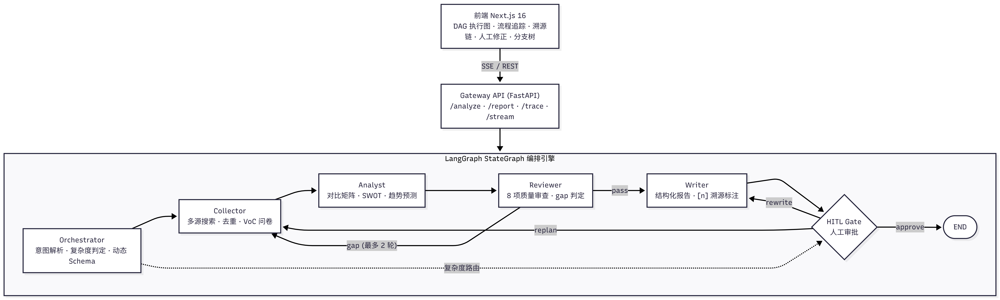

### 6 个 Agent 角色

| Agent | 职责 | 输出 |
|-------|------|------|
| **Orchestrator** | 意图解析 + 复杂度判定 + 维度权重 + 动态 Schema（深度 × 行业） | `OrchestrationResult` |
| **Collector** | 多源搜索采集 + 去重 + 自评覆盖率 + VoC 问卷生成 | `CollectedDataPoint[]` |
| **Analyst** | 对比矩阵 + SWOT + 趋势预测 + 动态维度 | `AnalysisResult` |
| **Reviewer** | 8 项质量审查 + gap 判定 + 打回重做 | `ReviewVerdict` |
| **Writer** | 结构化报告生成 + `[n]` 溯源标注 + traceability_map | `ReportData` |
| **HITL Gate / Rework Intent** | 人工审批；自然语言返工语义路由到重采集 / 重分析 / 重写 | `HitlDecision` / `ReworkIntent` |

Agent 间通过 **结构化 Pydantic Schema** 通信（非纯自然语言），每个环节的 Prompt、输入、输出均可在前端流程追踪面板中查看。

---

## 核心特性

### 反馈闭环

Reviewer 执行 **8 项质量审查**（数据覆盖、交叉验证、来源可信度、时间新鲜度、维度完整性等）+ **数字源头校验**（claim 中数字须在采集原文逐字可查），发现 gap 即打回 Collector/Analyst 重做，**最多 2 轮**。打回时精准定位缺失维度，**定向补采**而非全量重跑，减少 Token 消耗。每次重做后追踪改善率 + **修复增量**（repair delta），确保闭环真实可触发而非伪闭环。

### 信息溯源

每条分析结论标注 `[n]` 上标来源，hover 弹出 source card（URL、采集时间、置信度、验证状态），支持一键跳转到原始数据源。来源按域名历史可信度自动分为**强/中/弱**三档证据强度，低可信来源自动降权。

### 分析前范围确认

正式分析前先生成可编辑的 **Analysis Brief**，明确竞品、决策目标、分析维度与权重、行业、面向对象、时间范围、分析深度和证据策略。只有范围歧义消除并确认至少两个具体竞品和一个决策目标后，才会进入竞品解析与资料采集，避免用户意图在执行过程中被错误解释。

### 会话可靠性与恢复

分析状态由实时 SSE 和轻量轮询共同维护。轮询不会覆盖正在进行的确认、停止、批准或返工操作；网络异常时会保留输入草稿和失败原因，支持手动重试。SSE 断线后会使用事件 ID 继续接收未完成的进度，页面刷新也能从持久化状态恢复会话。

### 持续竞品观察

侧边栏的“竞品观察”工作台用于管理定时或固定间隔的增量采集任务。系统持久化事实基线和每次运行记录，只有检测到实质变化时才启动完整深度分析，从而避免重复搜索和模型调用。工作台可编辑、暂停、立即运行或删除观察任务，并集中查看变化时间线、任务运行历史、告警规则、静默与冷却策略、待发告警及投递历史；检测到实质变化的运行记录会直接提供对应完整报告入口，并通过“最新有变化的完整报告”和支持继续加载的独立历史报告归档保证全部旧报告不被近期无变化记录遮挡，无变化运行则明确标记为没有报告版本；所有任务、规则和记录均按用户隔离。

### 本地知识库与基础 RAG

侧边栏的“本地知识库”支持上传文件、导入受限 Inbox 路径，以及从持续观察情报池选择事实沉淀。持续观察发现的实质变化和新生成的分析报告版本会自动进入知识治理流程；系统按内容置信度、来源可信度、报告质量门与结论有据率决定自动准入或隔离待审。待审内容会保留完整来源追溯，但默认不可检索，失败任务可在界面创建保留原任务关系的新重试。TXT、Markdown、HTML、CSV、JSON 直接解析，PDF、Office 文档和图片由 Docling + RapidOCR 在本地解析；原文件、规范化 Markdown、文档版本、结构化分块和处理任务分别保存，重复内容不会生成新版本，新版本索引失败时继续保留旧版本可用。

检索采用 BGE-M3 Dense 向量与中文分词 BM25 Sparse 向量的 Qdrant RRF 混合召回，再由 bge-reranker-v2-m3 重排，并支持用户、知识空间、竞品、维度、市场、来源权威等级、发布时间以及当前/历史/全部/指定时间点版本过滤。查询规划器会让单一事实问题走低成本直查，将比较、时序和多维问题拆成多查询首跳与证据桥接跳，再对重复命中做融合。旧版本继续保存在 SQLite 和 Qdrant 中，索引重建会恢复全部成功版本；从持续观察导入事实时会按原始观察时间依次沉淀完整版本序列。分析阶段按“可引用原始证据、分层长期洞察、历史报告记忆”三个上下文层消费知识：历史报告只用于发现旧结论、补充问题和规划新搜索，不能进入 `collected_data` 或充当事实引用，且当前报告线程会被排除以避免自我引用。

GraphRAG 关系层使用 SQLite 保存竞品、能力、价格、集成、用户群、市场事件、来源和历史报告等类型化实体及带时间范围的关系，不引入额外图数据库。关系只从已批准资料版本和事件中确定性生成，并保留文档、版本、原始分块、事件、权威等级和观察时间追溯。单一事实查询继续走现有混合检索，只有跨竞品、关系或时间演化问题才启用图检索。图路径只有在对应原始分块同时进入本次 `collected_data` 时才能支持事实结论，否则仅作搜索导航和分析记忆；历史报告关系始终不可作为事实引用，当前报告线程同样会被排除。价格关系按版本关闭旧有效期，并将不同有效来源同时存在的价格差异显式标记为冲突。

知识空间提供所有者、编辑者和只读成员角色。空间可以要求资料审批、设置保留天数，审批前或驳回后的内容不会进入 Agent 证据；到期资料会从索引和文件存储中清理，同时保留不含正文的删除审计。空间所有者可将审核结果标记为“已核实、来源冲突、内容错误、资料过期”，附加说明和修正建议；系统保留不可变审核记录，并按反馈调整来源域名可信度，供后续自动准入使用。已批准版本会归一化竞品实体，将相似的跨来源事实归并成事件并标记单源观察或多源印证，再以“事实、推断、待验证假设”三层生成长期洞察，避免把推测伪装成结论。知识库页面同时展示版本变化、数值冲突、关系图谱、实体事件、分层洞察、治理状态和人工审核历史；图谱可按当前、历史或全部关系浏览，筛选关系并跳转到原始证据分块。

Collector 会先复用本地证据再补充实时搜索。Reviewer 从对比矩阵、SWOT、趋势和动态洞察中提取事实性主张，批量结合明确引用与本地语义检索，将每条主张标记为“证据支持”“存在矛盾”或“证据不足”，并检查数字与否定关系。Writer 只能把确认支持的证据作为正文引用，矛盾和相关但不足的材料仍保留在报告审计数据中。命中与核验结果沿用 `CollectedDataPoint`、Analysis Context Pack、`ReviewVerdict`、`ReportData` 和 `traceability_map` 契约；模型或索引不可用时核验会明确标记降级，分析主流程仍可继续。

检索验证支持“综合排序”“优先最新资料”和“优先高可信来源”三种策略，返回每条命中的时效分、来源权威分和排序策略，便于人工解释证据排序。`POST /api/competition/knowledge/evaluate` 接收版本化离线样例，计算 Recall、MRR、NDCG、拒答、追溯、核验、规划和治理指标，按阈值给出通过/失败结果并持久化到评估历史；知识库页面会显示最近评估和当前用户的检索配额，超限请求返回 `429` 与 `Retry-After`。

竞品观察支持独立的情报订阅。用户可以保存关注的竞品、维度、最低严重级别和通知渠道，订阅会复用现有告警引擎的匹配、去重和冷却逻辑。告警历史可直接标记“可信”“忽略”或“修正”，修正内容和反馈时间会持久化，供后续人工治理和告警策略迭代使用。相关接口为 `/api/competition/subscriptions` 和 `/api/competition/alerts/events/{event_id}/feedback`，订阅、反馈和告警均按用户隔离。

### 研究工作台

报告完成后可在全屏研究工作台中查看版本树、报告内容、质量门禁、语义核验、长期洞察、来源、证据图谱和执行流程。核验视图展示结论有据率、引用精确率、数字一致率以及每条主张的支持、矛盾和不足证据，并可跳转到报告来源或打开指定本地历史分块。洞察视图保留报告生成时匹配到的事实、推断和待验证假设，并区分已关联本次证据与仅作研判背景的内容。工作台同时支持历史版本切换、版本差异比较、报告导出、质量问题定位以及从论断跳转到对应章节或原始来源。报告正文目录、三栏滚动区域和长文本均有独立边界，避免内容互相遮挡。

每个报告版本都会保存不可变的完整快照，包含报告正文、分析结果、Reviewer 判定、阶段结果、Token 用量、采集数据、Analysis Brief、原始请求和返工意见。版本详情接口和工作台切换会按指定版本加载这些数据，质量、来源、证据和流程面板不会混入当前版本内容。历史数据按快照状态标记为“完整快照”“部分快照”或“不可恢复”，旧数据缺失时明确提示而不虚构报告。

### 报告人工修订

人工修订面板支持正文章节草稿、修改数量提示和统一提交。打开编辑框但未实际修改不会被标记为变更；提交时会自动包含当前仍在编辑的草稿，并返回更新数量和改善率。表格与图表章节保持只读，避免破坏结构化报告数据。

### 证据图谱

证据图谱把报告章节中的论断与 `[n]` 引用建立可交互映射，统计论断总数、已关联论断和待补证据，并区分多源、单源和无来源结论。点击论断可返回报告章节，点击来源可进入来源检查器并查看验证状态、可信度和原始链接。

### 并行报告生成

Writer 对相互独立的报告章节进行有界并行生成，同时保留稳定的章节顺序。每个任务具备并发上限、超时、取消、饱和保护和失败降级；单个章节失败时使用确定性 fallback，不阻塞整份报告生成，并在流程事件中反馈章节级进度。

### 质量门禁与版本审计

每个报告版本都保存独立的质量门禁快照，展示维度覆盖、来源质量、单源/多源/无源论断、阻断问题、警告、Reviewer 备注、返工轮次和改善指标。质量与来源信息随版本保存，便于审计返工前后的差异。

### 分支树 BranchTree

Agent 执行过程版本化管理——每次 HITL 干预创建新分支，支持从任意历史版本 fork、版本对比、分支合并。类似 Git for Agent workflow。报告生成后，用户也可以在同一个输入框继续输入自然语言返工要求，系统通过 Rework Intent Agent 语义判断应进入 `replan`（补采数据）、`reanalyze`（重做分析）或 `rewrite`（重写表达），并把新结果记录为可追踪版本。

### 返工输入与版本追踪

报告生成后，用户可以在同一个输入框继续输入自然语言返工要求；新 query 和返工 query 会作为用户气泡插入对应执行轮次前，便于把人工输入、Agent 阶段气泡和版本树对应起来。

### 动态 Schema

3 层分析维度模型：通用固定层 + 行业候选层 + LLM 自适应动态层。通用维度和行业候选会在 Analysis Brief 中展示，用户可以删除或调整权重；确认后的 `effective_dimensions` 是 Collector、Analyst、Reviewer 和 Writer 共同遵守的最终范围。Analyst 还可以根据已收集证据提出动态分析块，并记录提出理由、来源和是否纳入报告，避免模型静默扩大分析范围。

### 可观测面板

- **DAG 执行图**: 节点 5 状态高亮 + 边动画 + 反馈回环虚线 + 自评分数圆点
- **流程追踪**: 每节点 Prompt / 输入 / 输出 / Token / 结构化 JSON 可查
- **溯源链视图**: 报告结论 ↔ 原始数据源一键跳转
- **人工修正面板**: 报告章节在线编辑 + 提交改善率量化

### 来源可信度动态演化

每个数据源的域名维护可信度分数（0-1），Reviewer 每次校验后根据结果（verified/conflict/error/outdated）自动调分，跨分析 session 累积演化。采集时自动**持久化页面全文**，下游 Agent 可回溯原文验证 claim，不做仅靠摘要的二手判断。

### Agent 可靠性

内置**熔断器**（连续 3 次重复调用自动中断）防止 LLM 死循环烧 Token，per-Agent 超时 + 降级兜底保证单点故障不阻塞整体流程。

### 项目偏好配置

`profile.md` 定义分析风格、维度权重、来源规则等持久化偏好，Orchestrator 启动时自动注入 Prompt，跨 session 保持一致性。

### 飞书接入

支持分析完成自动私聊通知、自动导出飞书文档、报告卡片手动导出飞书文档三项能力。通过环境变量开关独立控制，默认关闭，不影响分析主流程。


---

## 技术栈

| 层 | 技术 |
|---|------|
| **编排** | LangGraph StateGraph + 条件路由 + 反馈闭环 |
| **后端** | Python 3.12 + FastAPI + Pydantic v2 + SQLite |
| **前端** | Next.js 16 + React 19 + TypeScript + Tailwind CSS 4 + [DeerFlow](https://github.com/bytedance/deer-flow)（auth / i18n / UI 组件） |
| **DAG 可视化** | [@xyflow/react](https://reactflow.dev/) (ReactFlow) |
| **LLM** | OpenAI 兼容 API |
| **搜索** | Tavily / DuckDuckGo / Jina AI / LLM 内置联网搜索 |
| **RAG 检索** | BGE-M3 + FastEmbed BM25 + Qdrant Local 混合召回 + bge-reranker-v2-m3 |
| **文档解析** | Docling + RapidOCR + BeautifulSoup；支持 PDF / Office / 图片 / HTML / Markdown / CSV / JSON / TXT |
| **部署** | uv + pnpm（Next.js 直接代理 FastAPI） |
| **持久化** | SQLite（业务与知识元数据）+ Qdrant Local（可重建向量索引）+ `.ci-agent/knowledge`（原文与规范化文档） |

---

## 快速开始

### 环境要求

| 依赖 | 版本 |
|------|------|
| Python | 3.12+ |
| uv | 最新稳定版 |
| Node.js | 22+ |
| pnpm | 10+ |

### Make 命令（推荐）

```bash
cp .env.example .env    # 编辑填写 DOUBAO_API_KEY 等
make install            # 安装依赖
make dev                # 低 I/O 启动全部服务
```

启动后访问 `http://localhost:2026/competition`。`make dev` 会在前端源码未变化时复用已有构建，后端不启用文件监听，适合共享服务器日常开发。

常用命令：

```bash
make stop               # 停止
make restart            # 重新以低 I/O 模式启动
make watch              # 前后端热更新（高 I/O，仅按需使用）
make start              # 使用已有前端 production build 启动
make test               # 运行测试
make lint               # 代码检查
make build              # 重新构建前端
```

在没有 pnpm 或受限服务器环境中，回退构建路径会使用已安装的 Next.js 二进制和 Webpack 产物；生产启动会复用 `.next` 构建，不要求开发服务器监听文件变化。

如需使用其他端口：

```bash
BACKEND_PORT=8002 FRONTEND_PORT=2027 make dev
```

### 分别启动

```bash
# 终端 1：后端
cd backend
PYTHONDONTWRITEBYTECODE=1 uv run --locked --no-dev --no-sync \
  uvicorn app.main:app --host 0.0.0.0 --port 8001

# 终端 2：前端（首次启动前先执行 pnpm build）
cd frontend
pnpm start --hostname 0.0.0.0 --port 2026
```

---

## 配置

项目支持**两种配置模式**，通过环境变量 `CI_AGENT_CONFIG_MODE` 切换：

| 模式 | 触发方式 | 配置来源 | 适用场景 |
|------|---------|---------|---------|
| **DB 模式**（默认） | 不设或 `CI_AGENT_CONFIG_MODE=db` | SQLite `user_settings` 表，通过设置界面管理 | 正式用户、多用户隔离 |
| **File 模式** | `CI_AGENT_CONFIG_MODE=file` | `config.yaml` + `.env` | 调试、演示、无账号场景 |

### 持续观察运行参数

FastAPI 启动时默认开启进程内观察调度器，适用于当前单进程部署。可通过以下环境变量调整：

| 变量 | 默认值 | 说明 |
|------|--------|------|
| `CI_AGENT_OBSERVATION_SCHEDULER_ENABLED` | `true` | 是否随 FastAPI 启动和停止观察调度器 |
| `CI_AGENT_OBSERVATION_POLL_SECONDS` | `30` | 扫描到期任务的间隔秒数，运行时最小为 5 秒 |
| `CI_AGENT_NOTIFICATION_WEBHOOK` | 空 | 可选的告警 Webhook；飞书通知仍沿用当前用户设置 |

观察任务和告警规则在 `/competition/monitoring` 管理。多进程或横向扩容部署应只启用一个调度实例，或将轮询迁移到独立任务工作器。

### 本地 RAG 模型与存储

依赖安装完成后，执行一次模型准备脚本（约需数 GB 磁盘和可访问 Hugging Face 的网络）：

```bash
uv run --project backend --locked python scripts/setup-rag-models.py
```

模型默认写入 `.ci-agent/models`，原始资料、规范化 Markdown 和 Qdrant 索引默认写入 `.ci-agent/knowledge`，两者均被 Git 忽略。运行时只加载本地资产，不会自动联网下载模型。知识库入口为 `/competition/knowledge`，默认单文件上限 50 MB；可将服务器本地资料放入 `.ci-agent/knowledge/inbox` 后，通过界面填写相对路径导入。

FastAPI 默认在后台预热本地检索模型，避免第一次分析承担完整模型加载时间。分析检索会规范化常见竞品别名与中英文维度名，将多个“竞品 × 维度”查询批量编码，并缓存重复的查询向量和检索结果；受控的中英文词组扩展默认关闭，只有设置 `CI_AGENT_RAG_QUERY_EXPANSION=true` 才会启用，且不会额外调用 LLM。资料新版本激活、删除或索引重建后会自动清除对应用户的结果缓存。

检索和评估接口按用户提供可替换的资源配额保护，默认每用户每分钟最多 600 次检索、30 次离线评估，可通过 `CI_AGENT_RAG_SEARCH_RATE_LIMIT` 和 `CI_AGENT_RAG_EVALUATION_RATE_LIMIT` 调整。配额只限制昂贵操作，不影响浏览文档、报告和既有观察历史。

评测报告同时包含 `query_expansion.baseline`、`query_expansion.expanded` 和 `query_expansion.delta`，用于比较关闭/开启受控查询扩展后的 Recall、MRR、NDCG 与 P95 延迟；只有在评测集显示收益时才应保持开启。

默认严格评测集 `evals/rag/real-v1.json` 由带来源 URL、采集时间和人工预期标签的公开一手竞品文档快照组成；`basic-v1.json` 保留为明确标记的合成单元回归集。评测数据不会写入业务知识库。以下命令会在临时 SQLite 和内存 Qdrant 中完成摄取、分级查询规划、检索、关系构建和主张核验，输出 Recall@5、MRR、NDCG@5、无答案拒答率、追溯完整率、P50/P95 延迟、直查/多跳路由准确率、问题拆解覆盖率、主张状态准确率、矛盾召回率、引用精确率、数字一致性准确率、结论有据率、治理准入准确率、隔离召回率、历史报告记忆召回率、记忆与事实证据隔离率、当前线程自排除率、图检索路由准确率、关系 Recall@5、关系证据追溯率、时序关系准确率及无依据关系率，并将详细报告写入已忽略的 `.ci-agent/evaluations/`：

```bash
make rag-eval
```

以下环境变量可覆盖默认位置与检索阈值：

| 变量 | 默认值 | 说明 |
|------|--------|------|
| `CI_AGENT_DB_PATH` | `.ci-agent/competition.db` | 业务与知识元数据 SQLite 路径 |
| `CI_AGENT_KNOWLEDGE_ROOT` | `.ci-agent/knowledge` | 原文、规范化文档、Inbox 与索引根目录 |
| `CI_AGENT_RAG_EMBEDDING_PATH` | `.ci-agent/models/embeddings/bge-m3` | Dense embedding 模型目录 |
| `CI_AGENT_RAG_RERANKER_PATH` | `.ci-agent/models/rerankers/bge-reranker-v2-m3` | Cross-Encoder 重排模型目录 |
| `CI_AGENT_RAG_FASTEMBED_PATH` | `.ci-agent/models/fastembed` | BM25 模型缓存目录 |
| `CI_AGENT_RAG_QDRANT_PATH` | `.ci-agent/knowledge/indexes/qdrant` | Qdrant Local 存储目录 |
| `CI_AGENT_RAG_MAX_UPLOAD_BYTES` | `52428800` | 单文件上传字节上限 |
| `CI_AGENT_RAG_MIN_SCORE` | `0.08` | 重排后的最低返回分数 |
| `CI_AGENT_RAG_PREWARM` | `true` | 是否在 FastAPI 启动后后台预热本地检索模型 |
| `CI_AGENT_RAG_QUERY_VECTOR_CACHE_SIZE` | `256` | 进程内查询向量 LRU 缓存容量，设为 `0` 可禁用 |
| `CI_AGENT_RAG_RESULT_CACHE_SIZE` | `256` | 按用户和过滤条件隔离的检索结果 LRU 缓存容量 |
| `CI_AGENT_RAG_RESULT_CACHE_TTL_SECONDS` | `300` | 检索结果缓存有效期，设为 `0` 可禁用 |
| `CI_AGENT_RAG_QUERY_EXPANSION` | `false` | 是否启用受控的中英文查询词组扩展，不触发额外 LLM 调用 |

### DB 模式（默认）

启动后访问 `/competition/settings`，在设置面板中配置 LLM 提供商、API Key、搜索后端、飞书凭证及 per-Agent 参数。所有配置按用户账号隔离存储在 `.ci-agent/competition.db` 的 `user_settings` 表中，登录即可跨设备同步；DB 模式下无需维护 `.env` 或 `config.yaml`。

设置面板包含三个区域：
- **API 凭证**：LLM Provider（名称 + Key + Base URL）、Tavily / Jina AI 独立保存、飞书凭证（多套动态增删）
- **配置组**：多组预设（groupA / groupB ...），每组独立控制搜索开关、飞书功能开关、per-Agent 覆盖
- **Per-Agent 覆盖**：每个 Agent 可独立指定 Provider / Model / Temperature / Timeout / Max Turns 等

<table>
<tr>
<td width="50%">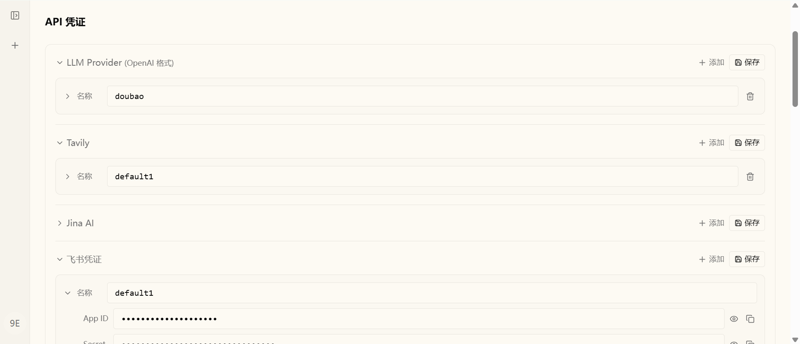</td>
<td width="50%">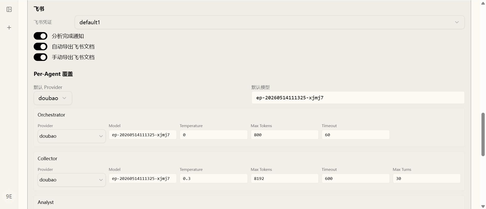</td>
</tr>
<tr>
<td align="center" width="50%"><b>用户配置：API 凭证</b> — LLM / 搜索 / 飞书凭证按账号隔离保存</td>
<td align="center" width="50%"><b>用户配置：配置组</b> — 多预设切换 + per-Agent 参数覆盖</td>
</tr>
</table>

### File 模式（调试/演示）

不使用数据库，直接从 `config.yaml` 和 `.env` 读取配置。适合调试、演示或无账号场景；LLM / 搜索 / 飞书密钥放在 `.env`，模型路由、搜索开关、飞书功能开关和 per-Agent 参数放在 `config.yaml`。File 模式下 `/competition` 可直接进入演示页面，无需登录。

```bash
cp .env.example .env
cp config.example.yaml config.yaml
# 编辑 .env 和 config.yaml 填写实际值
CI_AGENT_CONFIG_MODE=file make dev
```

### 配置同步脚本

`scripts/sync-user-config.py` 可在两种模式间迁移配置：

```bash
# 在项目根目录执行

# File → DB：将 config.yaml + .env 写入指定用户的 DB 记录
uv run --project backend --locked --no-dev --no-sync python scripts/sync-user-config.py push <user_email>

# DB → File：将用户 DB 记录写回 config.yaml + .env
uv run --project backend --locked --no-dev --no-sync python scripts/sync-user-config.py pull <user_email>

# 预览变更（不实际写入）
uv run --project backend --locked --no-dev --no-sync python scripts/sync-user-config.py push <user_email> --dry-run
uv run --project backend --locked --no-dev --no-sync python scripts/sync-user-config.py pull <user_email> --dry-run
```

### .env

所有 API 密钥通过环境变量注入。从模板复制并填写：

```bash
cp .env.example .env
```

`.env.example` 完整内容：

```bash
# ── LLM Providers (OpenAI-compatible, keys only — model/config in config.yaml)
# Doubao / Volcengine Ark
DOUBAO_API_KEY=your-doubao-api-key

# DeepSeek (optional — enable in config.yaml per-agent)
DEEPSEEK_API_KEY=your-deepseek-api-key

# Qwen / DashScope (optional)
QWEN_API_KEY=your-qwen-api-key

# ── Search API Keys ────────────────────────────────────────────────────────
TAVILY_API_KEY=your-tavily-api-key
JINA_API_KEY=your-jina-api-key

# ── Feishu (optional, switches in config.yaml) ─────────────────────────────
FEISHU_APP_ID=your-feishu-app-id
FEISHU_APP_SECRET=your-feishu-app-secret
FEISHU_NOTIFY_OPEN_ID=your-feishu-open-id
FEISHU_TENANT=your-feishu-tenant

# ── Continuous competitor monitoring ──────────────────────────────────────
CI_AGENT_OBSERVATION_SCHEDULER_ENABLED=true
CI_AGENT_OBSERVATION_POLL_SECONDS=30
CI_AGENT_NOTIFICATION_WEBHOOK=
```

LLM 密钥按需填写（使用哪个 provider 就填哪个），搜索类密钥未填写时自动退化为 DuckDuckGo 免费搜索。

> **注意**：DB 模式下 `.env` 和 `config.yaml` **不是必需的** — 所有配置都在设置界面中管理。File 模式下才需要手动维护这两个文件。

### config.yaml

File 模式下所有字段均有内置默认值，无需创建即可运行。如需切换 LLM 提供商或为不同 Agent 分配不同模型，从模板复制：

```bash
cp config.example.yaml config.yaml
```

`config.yaml` 采用 **提供商 + 配置组** 双层结构。提供商定义 API 连接信息，配置组聚合完整的独立预设，通过 `active_group` 一键切换：

```yaml
config_version: 12

competition:
  active_group: "groupA"        # 切换预设：groupA / groupB

  providers:                    # LLM 提供商定义
    doubao:
      api_key_env: "DOUBAO_API_KEY"
      api_base: "https://ark.cn-beijing.volces.com/api/v3"
    deepseek:
      api_key_env: "DEEPSEEK_API_KEY"
      api_base: "https://api.deepseek.com/v1"
    qwen:
      api_key_env: "QWEN_API_KEY"
      api_base: "https://dashscope.aliyuncs.com/compatible-mode/v1"

  groups:
    # ── Doubao 预设 ──
    groupA:
      default_provider: "doubao"
      # 模型ID
      default_model: "your-doubao-model-or-endpoint-id"

      search:                   # 搜索后端开关
        provider_search: true   # LLM 内置搜索（Doubao/Qwen）
        tavily: true
        ddg: true
        jina: true

      orchestrator:             # 意图解析（轻量模型即可）
        provider: "doubao"
        model: "your-doubao-model-or-endpoint-id"
        timeout_seconds: 60
      # ... collector / analyst / reviewer / writer 同理

      feishu:                   # 飞书功能开关（凭证在 .env）
        notify_enabled: false
        doc_auto_export: false
        doc_manual_export: false

    # ── DeepSeek 预设 ──
    groupB:
      default_provider: "deepseek"
      default_model: "your-deepseek-model"

      search:                   # DeepSeek 无内置搜索
        tavily: true
        ddg: true
        jina: false

      orchestrator:
        provider: "deepseek"
        model: "your-deepseek-model"
        timeout_seconds: 60
      # ... collector / analyst / reviewer / writer 同理

      feishu:
        notify_enabled: false
        doc_auto_export: false
        doc_manual_export: false
```

每个 Agent 可独立指定 `provider` + `model`，不填则自动继承 `default_provider` + `default_model`。`search.provider_search` 表示调用模型供应商内置搜索；Tavily / Jina 未配置密钥时会自动跳过对应后端。

### 飞书接入（可选）

分析完成自动通知、自动导出飞书文档、手动导出飞书文档三项能力都按配置模式读取：DB 模式在设置面板的配置组里开启；File 模式在 `config.yaml` 各配置组的 `feishu` 段开启。

```yaml
feishu:
  notify_enabled: true        # 分析完成飞书私聊通知
  doc_auto_export: true       # 分析完成自动导出飞书文档
  doc_manual_export: true     # 报告卡片显示「导出飞书」按钮
```

**前提准备**（全部功能共用）：

1. 登录 [飞书开放平台](https://open.feishu.cn/app) → 创建「企业自建应用」
2. 添加应用能力 → 开启「机器人」
3. 权限管理 → 添加以下权限后发布新版本：
   - `im:message:send_as_bot`（通知）
   - `docx:document`（创建文档）
   - `drive:drive`（转让文档所有权）

**获取配置变量**：

| 变量 | 说明 | 获取方式 |
|------|------|---------|
| `FEISHU_APP_ID` | 应用 ID | 应用详情页 → 凭证与基础信息 |
| `FEISHU_APP_SECRET` | 应用密钥 | 同上 |
| `FEISHU_NOTIFY_OPEN_ID` | 通知接收人 Open ID | API 调试台 → 发送消息接口 → 快速复制 open_id |
| `FEISHU_TENANT` | 飞书租户域名 | 飞书网页版地址 `xxx.feishu.cn` 的 `xxx` 部分 |

填入 `.env`：

```bash
FEISHU_APP_ID=your-feishu-app-id
FEISHU_APP_SECRET=your-feishu-app-secret
FEISHU_NOTIFY_OPEN_ID=your-feishu-open-id
FEISHU_TENANT=your-tenant
```

<p align="center">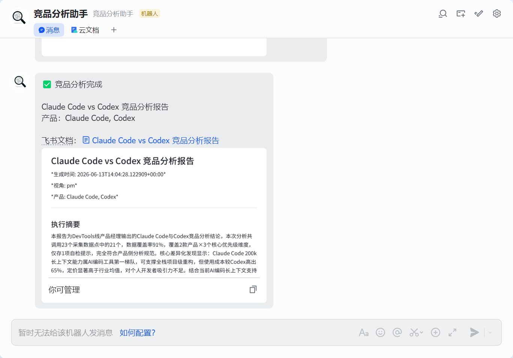</p>

> 手动导出时浏览器可能拦截新窗口弹窗，请允许弹窗；文档所有权转让有数秒延迟，刷新或稍等即可看到。

### 配置文件位置

两项配置均放在**项目根目录**：

```
competitive-analysis-agent/
├── .env               # API 密钥（不提交 Git）
├── config.yaml        # Agent 参数调优（不提交 Git）
├── .env.example       # 密钥模板（可提交）
└── config.example.yaml # 参数模板（可提交）
```

---

<!--
## 运行示例

> **Query**: "深度分析 Claude Code 和 Codex，特别是定价方面"  
> **Thread**: `comp-05350dc0770f` · 耗时 ~15 分钟 · 总 Token 20,840 · 产出 9 章节报告

### 全流程截图

<table>
<tr>
<td width="50%">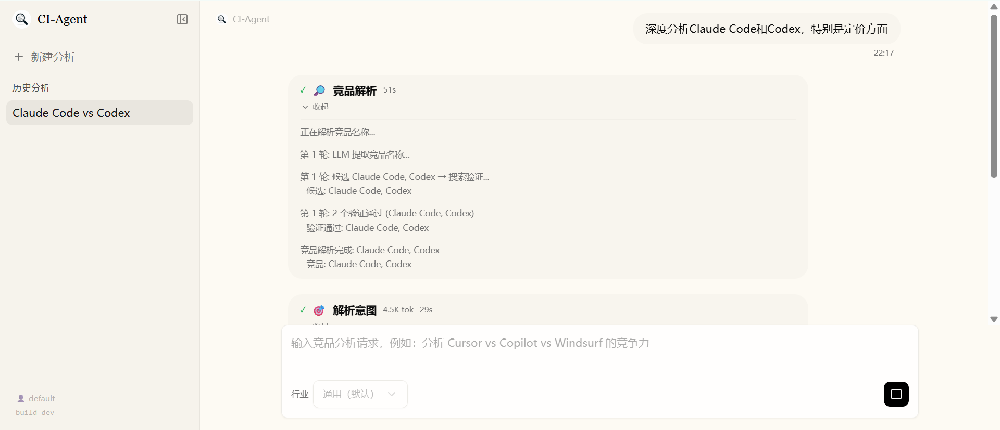</td>
<td width="50%">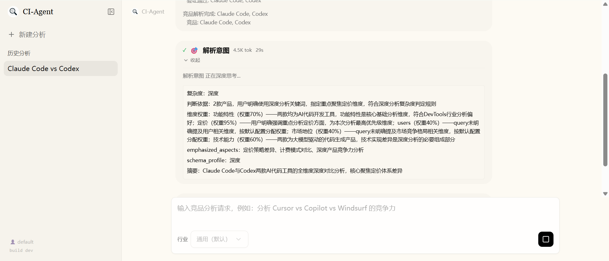</td>
</tr>
<tr>
<td align="center" width="50%"><b>竞品解析</b> — 产品名识别 + 纠错</td>
<td align="center" width="50%"><b>意图解析</b> — Orchestrator 判定 standard 模式</td>
</tr>
<tr>
<td width="50%">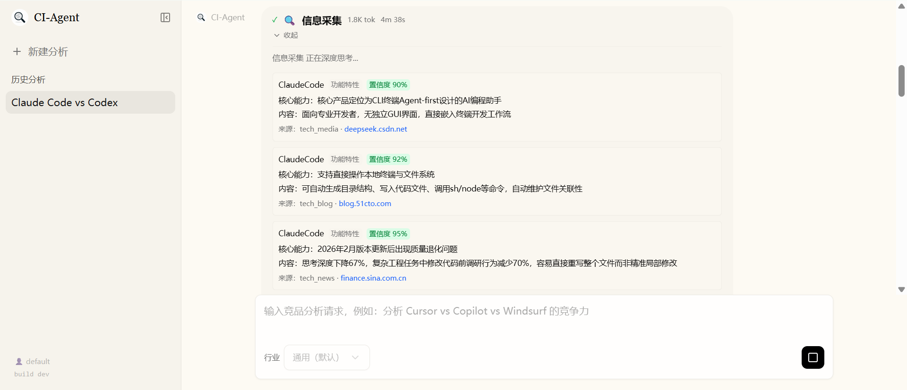</td>
<td width="50%">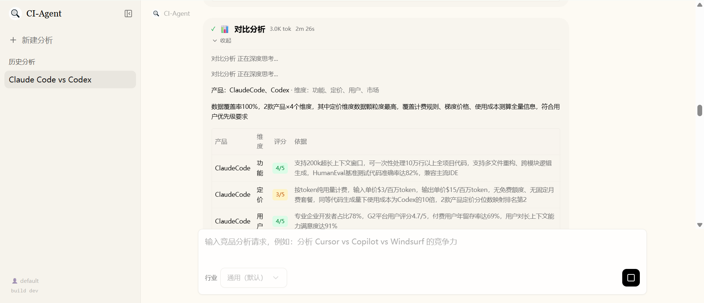</td>
</tr>
<tr>
<td align="center" width="50%"><b>信息采集</b> — 多源搜索 12 条结构化数据点</td>
<td align="center" width="50%"><b>对比分析</b> — 功能 × 定价 × 用户 × 市场矩阵</td>
</tr>
<tr>
<td width="50%">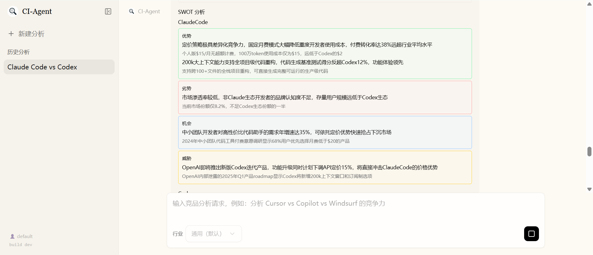</td>
<td width="50%">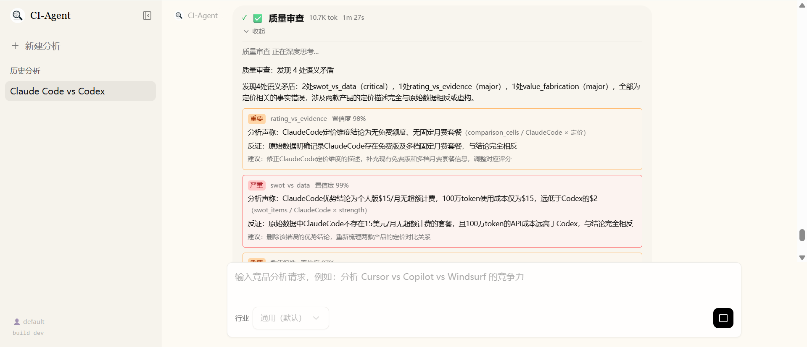</td>
</tr>
<tr>
<td align="center" width="50%"><b>SWOT + 趋势</b> — 预测推演 + What-if</td>
<td align="center" width="50%"><b>质量审查</b> — G7 语义矛盾检测 + 定向返工</td>
</tr>
<tr>
<td width="50%">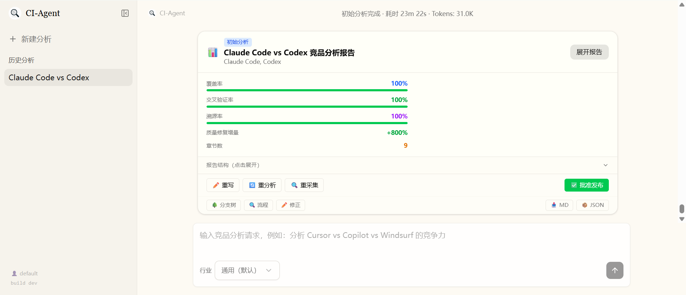</td>
<td width="50%">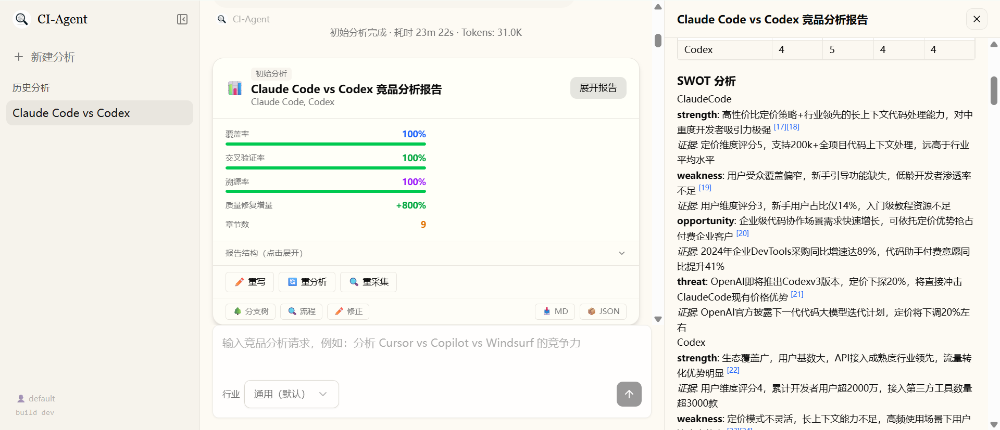</td>
</tr>
<tr>
<td align="center" width="50%"><b>报告卡片</b> — 指标条 + 证据强度 + 可折叠</td>
<td align="center" width="50%"><b>报告展开</b> — 内联溯源 [n] + DAG 图 + 追踪面板</td>
</tr>
<tr>
<td width="50%">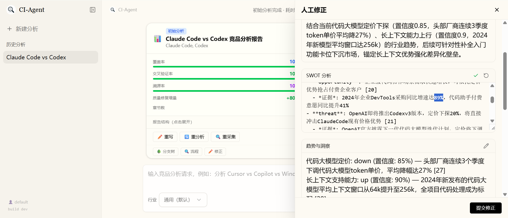</td>
<td width="50%">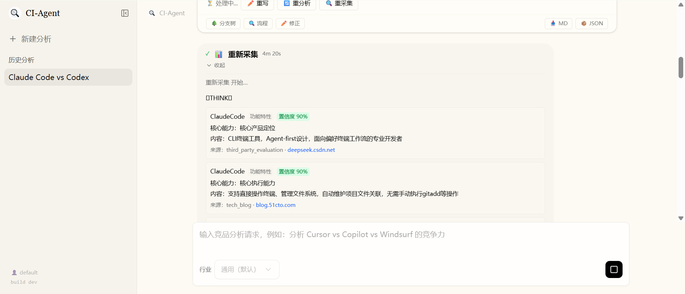</td>
</tr>
<tr>
<td align="center" width="50%"><b>人工修正</b> — 就地编辑 + 改善率追踪</td>
<td align="center" width="50%"><b>重采集 / 重分析</b> — HITL 四按钮干预</td>
</tr>
<tr>
<td width="50%">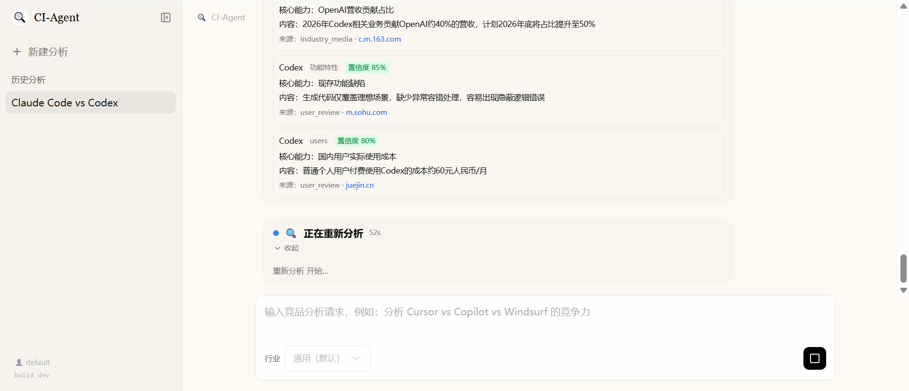</td>
<td width="50%">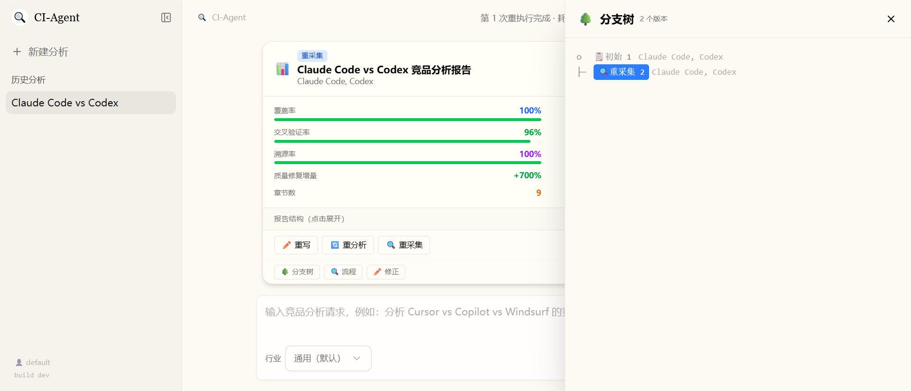</td>
</tr>
<tr>
<td align="center" width="50%"><b>重分析结果</b> — 版本间指标对比</td>
<td align="center" width="50%"><b>分支树</b> — v1 初始分析 → v2 重分析</td>
</tr>
</table>

<p align="center">
  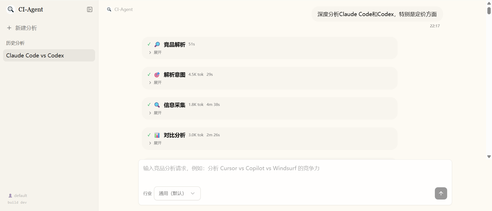<br/>
  <b>会话界面总览</b> — 左侧阶段气泡 + 中间报告卡片 + 右侧面板
</p>

### 内部流转


| 阶段 | Agent | 耗时 | Token | 关键产出 |
|------|-------|------|-------|---------|
| 🔍 竞品解析 | (前置) | 125s | 1,713 | "Claude Code" → Claude Code (Anthropic) |
| 🎯 意图解析 | Orchestrator | 12s | 51 | complexity=standard, 定价权重 0.9 |
| 📊 信息采集 | Collector | 259s | 4,002 | 12 条结构化数据点 (products×dimensions) |
| 🔬 对比分析 | Analyst | 66s | 3,529 | 2×4 对比矩阵 + SWOT + 趋势预测 |
| ✅ 质量审查 | Reviewer | 97s | 10,591 | G1-G8 8 项检查, 发现 3 个 gap |
| 🔄 定向返工 | Analyst→Reviewer | 71s+34s | — | 补采缺失维度, 交叉验证通过 |
| 📝 报告撰写 | Writer | 264s | 954 | 9 章节: 摘要·矩阵·SWOT·趋势·建议 |
| 📋 **合计** | — | **~15min** | **20,840** | **覆盖率 100% · 溯源率 100%** |

> **关键指标**: 交叉验证率 0%（初版已知 Bug，已修复）· 改善率 80% · 9 章节约 3,000 字 · 溯源链接 12 条

### 定向返工闭环

当 Reviewer 检测到数据覆盖不足时，系统自动触发**定向返工**——精确指定缺失的产品×维度组合，Collector **只补采缺口数据**而非全量重跑：

```
Collector → Analyst → Reviewer
              ↑          │
              │          ├─ pass → Writer → HITL Gate
              │          └─ gap → rework_plan: {product: "Claude Code", dimension: "pricing"}
              │                    │
              └────────────────────┘ (定向补采, 非全量重跑)
```

本示例中，Reviewer 识别到 3 个 gap 后触发 1 轮定向返工，改善率提升至 80%。
暂时隐藏：运行示例截图对应旧版前端界面，待新版研究工作台和报告视图截图更新后再恢复展示。
-->

---

## 目录结构

```
competitive-analysis-agent/
├── backend/
│   ├── app/
│   │   ├── main.py                    # FastAPI 应用入口 + auth stub
│   │   └── competition_router.py      # /analyze /report /trace /stream 路由
│   ├── packages/competition/          # 竞赛核心包
│   │   └── competition/
│   │       ├── nodes/                 # 6 个 Agent 节点实现
│   │       │   ├── orchestrator.py    # Orchestrator: 意图解析 + 路由决策
│   │       │   ├── collector.py       # Collector: 多源采集 + VoC
│   │       │   ├── analyst.py         # Analyst: 对比分析 + SWOT + 趋势
│   │       │   ├── reviewer.py        # Reviewer: 8 项质量审查 + gap 判定
│   │       │   ├── writer.py          # Writer: 报告生成 + 溯源标注
│   │       │   ├── hitl_gate.py       # HITL Gate: LangGraph interrupt()
│   │       │   ├── rework_intent.py   # 自然语言返工意图路由：replan / reanalyze / rewrite
│   │       │   ├── error_handler.py   # 错误处理 + 降级
│   │       │   └── deep_*.py          # 深度模式节点 (deep 模式)
│   │       ├── tools/                 # Agent 工具
│   │       │   ├── search.py          # 多源搜索 (Tavily / DDG / Jina)
│   │       │   └── video_source.py    # YouTube / Bilibili 字幕提取
│   │       ├── prompts/               # Agent 提示词 (Markdown, 每个 Agent 一篇)
│   │       ├── branchtree/            # 分支树 + CheckpointOps
│   │       │   ├── tree.py            # BranchTree: snapshot / fork / restore / lineage
│   │       │   ├── node.py            # BranchNode 数据结构
│   │       │   ├── store.py           # SQLite 持久化 (branch_snapshots 表)
│   │       │   ├── checkpoint_ops.py  # LangGraph checkpoint 便捷操作
│   │       │   ├── adapter.py         # State ↔ BranchTree 双向桥接
│   │       │   ├── diff.py            # 节点/版本对比
│   │       │   └── merge.py           # 分支合并
│   │       ├── graph.py               # LangGraph StateGraph 构建
│   │       ├── state.py               # CompetitionState 定义
│   │       ├── schema.py              # Pydantic Schema + 校验
│   │       ├── router.py              # 条件路由逻辑
│   │       ├── dag.py                 # DAG 状态提取器
│   │       ├── db.py                  # SQLite 业务表 (4 张)
│   │       ├── executor.py            # LLM 调用封装
│   │       ├── knowledge_service.py   # 知识摄取、版本、检索与证据导出
│   │       ├── knowledge_parser.py    # 多格式本地解析与 OCR
│   │       ├── knowledge_chunking.py  # 结构感知上下文化分块
│   │       ├── knowledge_index.py     # Dense/Sparse Qdrant + 重排
│   │       ├── knowledge_repo.py      # 知识文档、版本、分块和任务持久化
│   │       ├── graph_algorithms.py    # 图拓扑算法
│   │       ├── industry.py            # 行业 profile 定义
│   │       ├── config.py              # 配置模型
│   │       ├── visualization.py       # matplotlib/seaborn 图表
│   │       └── observability.py       # 可观测性工具
│   ├── tests/                         # 后端测试
│   ├── pyproject.toml                 # Python 项目配置 (uv workspace)
│   └── uv.lock                        # 依赖锁定
├── frontend/
│   └── src/
│       ├── app/competition/           # /competition 路由页面
│       │   ├── competition-shell.tsx  # SidebarProvider + competition 布局状态
│       │   ├── layout.tsx             # 根布局
│       │   ├── page.tsx               # 首页 (新建分析)
│       │   ├── knowledge/             # 本地知识库管理与检索验证
│       │   └── [thread_id]/           # 分析详情页 (动态路由)
│       ├── app/api/competition/       # SSE 流代理端点
│       └── components/competition/    # 竞赛 UI 组件
│           ├── competition-chat-area.tsx       # 主聊天区
│           ├── competition-report-panel.tsx    # 报告面板
│           ├── competition-report-card.tsx     # 报告卡片
│           ├── dag-graph.tsx                   # DAG 执行图
│           ├── process-trace-panel.tsx         # 流程追踪面板
│           ├── report-editor.tsx               # 人工修正编辑器
│           ├── branch-tree-panel.tsx           # 分支树面板
│           ├── source-card.tsx                 # 溯源卡片 (hover 弹窗)
│           ├── source-inspector.tsx             # 来源检查器
│           ├── evidence-graph.tsx              # 论断 ↔ 来源证据图谱
│           ├── quality-gate-panel.tsx           # 质量门禁与返工指标
│           ├── research-workbench.tsx           # 版本/报告/质量/来源/流程工作台
│           ├── hitl-card.tsx                   # HITL 审批卡片
│           ├── agent-detail-panel.tsx          # Agent 节点详情
│           ├── analysis-timeline.tsx           # 分析时间线
│           ├── message-flow-timeline.tsx       # 消息流时间线
│           ├── token-panel.tsx                 # Token 消耗面板
│           ├── version-tree.tsx                # 版本树
│           ├── competition-header.tsx          # 顶部导航栏
│           ├── competition-sidebar.tsx         # 侧边栏
│           ├── competition-history-list.tsx    # 历史记录列表
│           ├── competition-query-input.tsx     # 查询输入框
│           └── replay-slider.tsx               # 回放滑块
├── scripts/
│   ├── restart-light.sh               # 生产实例一键重启（含 IO 防护）
│   ├── dev-instance.sh                # 调试实例启动（:8002/:3001/:2027）
│   └── cleanup-all.sh                 # 进程 + 端口清理
├── docker/
│   ├── docker-compose.yaml            # 生产部署
│   ├── docker-compose-dev.yaml        # 开发部署
│   ├── dev-entrypoint.sh              # 开发容器入口
│   ├── nginx/                         # Nginx 配置
│   └── provisioner/                   # Sandbox 资源预配器
├── images/                            # 文档图片
├── .env.example                       # 环境变量模板
├── config.example.yaml                # Agent 配置模板
├── Makefile                           # 构建/启动/测试快捷命令
├── README.md                           # 中文项目说明
└── README_en.md                        # English project documentation
```

---

## 竞赛要求覆盖

| 要求 | 描述 | 实现位置 |
|------|------|---------|
| R1 | 6 Agent 职责边界清晰 | `nodes/orchestrator.py` `collector.py` `analyst.py` `reviewer.py` `writer.py` `hitl_gate.py` |
| R2 | Collector 双轨采集 + 问卷 | `nodes/collector.py` VoC Aggregator |
| R3 | 竞品知识 Schema (FeatureTree/PricingModel/UserPersona) | `schema.py` |
| R4 | Agent 间结构化 JSON 通信 | `schema.py` AnalysisResult/ReviewVerdict/ReviewPackage/ReportData/HitlDecision |
| R5 | Reviewer 8 项 gap 判定 + 打回 | `nodes/reviewer.py` + `router.py` |
| R6 | 反馈改善率量化 | `competition_router.py` improvement_ratio |
| R7 | 溯源标注 `[n]` + traceability_map | `nodes/writer.py` + 前端 `source-card.tsx` |
| R8 | Schema 强制校验 + 重试 + 降级 | `schema.py` model_validate() |
| R9 | DAG 图实时高亮 + 边动画 | `dag.py` + 前端 `dag-graph.tsx` |
| R10 | Prompt/输入/输出/决策过程/Token 可查 | 前端 `process-trace-panel.tsx` + `agent-detail-panel.tsx` + `competition_router.py` /trace |
| R11 | 端到端链路完整，可现场演示 | `graph.py` 全链路编排 + `competition_router.py` SSE 流式 + 前端完整交互 |
| R12 | 幻觉抑制：引用强制 + 自一致性 + 分片 | `nodes/reviewer.py` + `nodes/analyst.py` |
| R13 | 超时重试 + 降级机制 | `config.py` per-Agent timeout + `nodes/error_handler.py` C/D 级错误决策树 |
| R14 | 前瞻性：BranchTree + CheckpointOps + 来源可信度 | `branchtree/` + `db.py` source_credibility |
| R15 | 输出指标可量化（覆盖率/交叉验证率/改善率） | `nodes/writer.py` compute_metrics() + `schema.py` metrics |

---

## 独立 A2A Provider

项目提供基于官方 `a2a-sdk==1.1.2`（A2A 协议 `1.0`）的独立 Provider。SDK 版本固定是为了让 AgentCard、JSON-RPC、Task、Artifact 和 SSE 序列化保持可复现；Provider 不依赖任何特定客户端或 Hub。

默认端点如下：

| 能力 | 地址 |
|------|------|
| AgentCard | `GET /.well-known/agent-card.json` |
| JSON-RPC | `POST /a2a` |
| 标准 REST 绑定 | `/a2a/message:send`、`/a2a/message:stream`、`/a2a/tasks/{id}`、`/a2a/tasks/{id}:cancel` |

启动后可发现 AgentCard：

```bash
curl http://localhost:8001/.well-known/agent-card.json
```

生产环境默认要求 Bearer/API key。设置 `CI_AGENT_A2A_API_KEY` 后，客户端使用 `Authorization: Bearer <key>`，并可用 `X-A2A-Client-ID` 与 `X-A2A-Tenant` 划分调用方和租户。仅本地调试时才显式设置 `CI_AGENT_A2A_AUTH_REQUIRED=false`。A2A Task、上下文映射、状态事件和报告 Artifact 持久化在 SQLite，和内部 `thread_id` 分离。

可通过 `CI_AGENT_A2A_ENABLED` 开关 Provider；`CI_AGENT_A2A_MAX_CONCURRENCY`、`CI_AGENT_A2A_RATE_LIMIT_PER_MINUTE` 和 `CI_AGENT_A2A_MAX_REQUEST_BYTES` 控制并发、速率与请求大小；`CI_AGENT_A2A_TASK_TIMEOUT_SECONDS`、`CI_AGENT_A2A_MAX_ATTEMPTS` 和 `CI_AGENT_A2A_LEASE_SECONDS` 控制任务超时、有限重试与跨进程执行租约。服务重启后会从 SQLite 恢复仍处于 submitted/working 的任务，已完成、失败、取消或等待输入的任务不会被重复启动。

发送文本请求（标准 JSON-RPC 方法名由 SDK 定义）：

```bash
curl -X POST http://localhost:8001/a2a -H 'Content-Type: application/json' -H 'A2A-Version: 1.0' -H 'Authorization: Bearer <key>' -H 'X-A2A-Client-ID: cli-demo' -d '{"jsonrpc":"2.0","id":"1","method":"SendMessage","params":{"message":{"messageId":"m-1","role":"ROLE_USER","parts":[{"text":"比较 Cursor 和 GitHub Copilot，重点关注团队采用成本"}]}}}'
```

响应中的 `result.task.id` 是外部 A2A Task ID。使用 `GetTask` 查询，使用 `SendStreamingMessage` 订阅标准 SSE；流断开后可重复调用 `GetTask` 或 `SubscribeToTask` 恢复。若任务状态为 `TASK_STATE_INPUT_REQUIRED`，带同一个 `taskId`、`contextId` 发送下一条 Message（可在 DataPart 中传入 `{"brief": {...}}`）继续执行。取消使用 `CancelTask`，完成后报告以 `application/json` Artifact 返回。

```bash
curl -N -X POST http://localhost:8001/a2a -H 'Content-Type: application/json' -H 'A2A-Version: 1.0' -H 'Authorization: Bearer <key>' -d '{"jsonrpc":"2.0","id":"2","method":"SendStreamingMessage","params":{"message":{"messageId":"m-2","taskId":"<task-id>","contextId":"<context-id>","role":"ROLE_USER","parts":[{"text":"确认分析范围并继续"}]}}}'
curl -X POST http://localhost:8001/a2a -H 'Content-Type: application/json' -H 'A2A-Version: 1.0' -H 'Authorization: Bearer <key>' -d '{"jsonrpc":"2.0","id":"3","method":"GetTask","params":{"id":"<task-id>"}}'
curl -X POST http://localhost:8001/a2a -H 'Content-Type: application/json' -H 'A2A-Version: 1.0' -H 'Authorization: Bearer <key>' -d '{"jsonrpc":"2.0","id":"4","method":"CancelTask","params":{"id":"<task-id>"}}'
```

运行 A2A 回归测试：

```bash
cd backend
uv run --locked pytest tests/test_a2a_provider.py
```

## API 接口

| 方法 | 路径 | 说明 |
|------|------|------|
| POST | `/api/competition/analyze` | 创建竞品分析任务，返回 thread_id |
| GET | `/api/competition/stream/{thread_id}` | SSE 实时事件流（进度推送 + Agent 输出） |
| GET | `/api/competition/report/{thread_id}` | 获取分析报告与阶段数据 |
| GET | `/api/competition/report/{thread_id}/history` | 获取版本历史与分支树 |
| GET | `/api/competition/report/{thread_id}/versions/{version}` | 获取指定报告版本的不可变完整快照 |
| GET | `/api/competition/report/{thread_id}/trace` | 获取 Agent 执行追踪日志 |
| PATCH | `/api/competition/report/{thread_id}/sections` | 人工修正报告章节 |
| PUT | `/api/competition/report/{thread_id}` | 提交 HITL 审批决策 |
| POST | `/api/competition/{thread_id}/cancel` | 终止运行中的分析 |
| GET | `/api/competition/report/{thread_id}/export` | 导出报告（Markdown / JSON） |
| GET | `/api/competition/me` | 获取当前用户信息 |
| GET | `/api/competition/history` | 获取历史分析列表 |
| GET | `/api/competition/observation/runtime` | 获取持续观察调度器状态 |
| GET / POST | `/api/competition/observation/schedules` | 查询或创建当前用户的观察任务 |
| PUT / DELETE | `/api/competition/observation/schedules/{schedule_id}` | 编辑或删除观察任务 |
| POST | `/api/competition/observation/schedules/{schedule_id}/run-now` | 立即运行观察任务 |
| GET | `/api/competition/observation/runs` | 查询当前用户的观察运行历史 |
| GET | `/api/competition/intelligence/changes` | 查询增量情报变化时间线 |
| GET | `/api/competition/intelligence/changes/{change_id}` | 查询单条变化详情、当前事实、来源和版本历史 |
| GET | `/api/competition/intelligence/items` | 查询可显式沉淀到知识库的情报事实 |
| GET | `/api/competition/intelligence/sources` | 查询来源健康、失败次数、延迟和备用来源诊断 |
| GET | `/api/competition/knowledge/status` | 获取知识库、模型与索引状态 |
| GET | `/api/competition/knowledge/retrieval-logs` | 查询当前用户的检索规划、过滤条件、命中分块、耗时与状态 |
| GET / POST / PATCH | `/api/competition/knowledge/spaces` | 管理项目知识空间、审批和保留策略 |
| GET / PUT / DELETE | `/api/competition/knowledge/spaces/{space_id}/members` | 管理空间成员及只读/编辑权限 |
| POST | `/api/competition/knowledge/documents/{document_id}/review` | 批准或分类驳回待审资料，并记录说明、修正和来源可信度反馈 |
| GET | `/api/competition/knowledge/reviews` | 按当前用户可见知识空间查询人工治理记录 |
| GET | `/api/competition/knowledge/governance/stats` | 汇总文档审核、关系审计、假设状态和文档通过率 |
| GET | `/api/competition/knowledge/events` | 查询归一化实体的跨来源事件时间线 |
| GET / POST | `/api/competition/knowledge/insights` / `/api/competition/knowledge/insights/refresh` | 查询或重算事实、推断和假设三层洞察 |
| GET | `/api/competition/knowledge/deletions` | 查询可审计删除记录 |
| POST | `/api/competition/knowledge/retention/run` | 立即执行到期保留策略 |
| POST | `/api/competition/knowledge/upload` | 上传并异步解析、分块和索引资料 |
| POST | `/api/competition/knowledge/import-inbox` | 从受限 Inbox 相对路径导入本地文件 |
| POST | `/api/competition/knowledge/import-intelligence` | 将显式选择的情报事实沉淀为知识文档 |
| GET | `/api/competition/knowledge/documents` | 按状态、竞品和来源类型分页查询资料 |
| GET / DELETE | `/api/competition/knowledge/documents/{document_id}` | 查看版本与分块详情，或删除资料 |
| POST | `/api/competition/knowledge/documents/{document_id}/reindex` | 重新解析并索引当前可用版本 |
| GET | `/api/competition/knowledge/jobs`、`/api/competition/knowledge/jobs/{job_id}` | 查询异步导入与重建任务状态 |
| POST | `/api/competition/knowledge/jobs/{job_id}/retry` | 为失败的知识处理任务创建可追溯重试 |
| POST | `/api/competition/knowledge/search` | 执行带元数据过滤的混合检索与重排 |
| GET | `/api/competition/knowledge/graph` | 按知识空间、关系类型和时间范围查询可追溯关系图谱 |
| POST | `/api/competition/knowledge/graph/rebuild` | 从已批准资料版本和事件重建指定知识空间的关系图谱 |
| GET | `/api/competition/knowledge/chunks/{chunk_id}` | 获取用户有权访问的证据原文分块 |
| POST | `/api/competition/knowledge/rebuild` | 从 SQLite 业务数据重建当前用户的 Qdrant 索引 |
| GET / POST | `/api/competition/alerts/rules` | 查询或创建告警规则 |
| PUT / DELETE | `/api/competition/alerts/rules/{rule_id}` | 编辑或删除告警规则 |
| GET / POST | `/api/competition/alerts/events` / `/api/competition/alerts/dispatch` | 查询告警历史或投递待发告警 |

报告轮询可使用 `?summary=true` 获取轻量状态响应；分析进入终态后接口仍返回完整报告内容。

后端 FastAPI 自动生成 Swagger 文档：`http://localhost:8001/docs`

---

## 未来展望

当前系统基于实时搜索 + 本地混合 RAG，并使用 SQLite、Qdrant Local 和文件存储持久化业务、知识与证据数据，满足竞赛阶段端到端分析需求。以下方向为产品化迭代预留的架构设计：

### RAG P1 已完成

- 检索日志和治理统计已接入知识库页面，可查看查询、命中分块、延迟、审核结果和来源健康。
- 查询扩展评测会对比关闭/开启状态下的 Recall、MRR、NDCG 和 P95 延迟，避免无评测依据地增加召回成本。
- 竞品情报池支持内容版本、来源健康和失败记录；观察任务仅在检测到实质变化时触发深度分析。
- 告警支持内容去重、冷却、静默时段、摘要/即时模式；报告、告警和系统错误统一经过隔离失败的通知路由。

### RAG 深化

- **检索反馈与可解释性闭环**：通过检索日志接口回放查询规划、过滤条件、命中分块和延迟，并汇总文档、关系和假设治理结果，支持前端展示和后续质量优化
- **前端诊断面板**：知识库页面展示最近检索记录、治理质量和来源健康；来源异常只会降低证据质量，不会被静默标记为官方来源

- **受评测约束的生成式查询增强**：在当前零 LLM 的直查/多跳规划器之上，对确有收益的复杂问题增加可关闭的模型改写或 HyDE，并继续用真实黄金集约束成本和召回
- **关系与假设治理深化**：在现有可追溯 GraphRAG、三层洞察和资料审核反馈之上，增加人工关系修订、假设批准/驳回及历史准确率统计
- **持续扩充真实评测覆盖**：逐步加入经授权的真实报告、观察历史、PDF/OCR 难例、跨语言问题和高相似负样本，不使用业务数据训练或污染生产知识库

### 高并发与生产化

- **状态外置**：当前分析状态存储在内存 `_store` 字典中（单进程有效）。迁移至 Redis 或 PostgreSQL 后，Gateway 可水平扩展为多实例，任意实例接手任意请求
- **异步任务队列**：当前分析在 `threading.Thread` 中执行。引入 Celery / Redis Queue 后，分析任务可分布到独立 Worker 节点，Gateway 只负责接收请求和推送 SSE，解耦计算与 IO
- **数据库升级**：SQLite WAL 模式支持有限并发写入（串行化锁）。迁移到 PostgreSQL 后，支持真正并发读写、连接池管理、读写分离
- **LLM 配额管理**：引入 per-user / per-tenant 的 Token 预算和速率限制，防止单用户耗尽全局配额；搜索 API 同理需要按租户限流
- **多用户项目隔离**：当前 demo 使用自动登录，后续可基于 DeerFlow 已有的 auth 模块实现多用户隔离、项目空间和权限控制

---

## License

[MIT](LICENSE)
