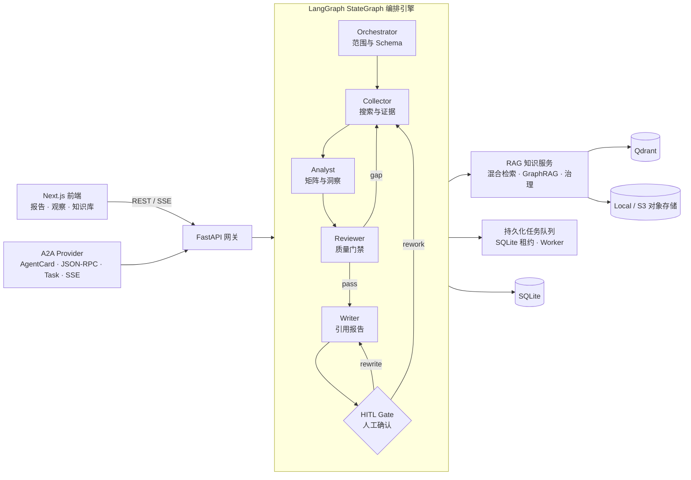

# 架构与工作流

## 系统边界

系统由 Next.js 前端、FastAPI 网关、LangGraph 竞品分析流程和 SQLite/Qdrant 知识存储组成。对外提供现有 REST/SSE API，以及独立的标准 A2A Provider。A2A 只暴露整个竞品分析系统这个黑盒 Agent，内部 Agent 不作为外部 Agent 暴露。

## 完整架构图

## LangGraph 流程

| 阶段 | 角色 | 主要产出 |
| --- | --- | --- |
| 编排 | Orchestrator | 意图、复杂度、有效分析维度和 Schema |
| 采集 | Collector | 多源、去重、带来源的数据点和覆盖率 |
| 分析 | Analyst | 对比矩阵、SWOT、趋势和动态分析块 |
| 审查 | Reviewer | 质量门禁、引用/数字校验、缺口和返工计划 |
| 写作 | Writer | 结构化报告、章节、引用和 `traceability_map` |
| 人工门 | HITL Gate | 确认、批准、取消或自然语言返工意图 |

Agent 之间只通过 Pydantic Schema 传递结构化数据。`CompetitionState` 面向业务流程状态，`StageResult` 保存每个阶段的统一执行结果、耗时、Token、状态和错误，二者保持职责分离。

## 范围确认与动态维度

Analysis Brief 是正式分析的边界合同，包含竞品、决策目标、维度及权重、行业、面向对象、时间范围、深度和证据策略。范围存在歧义或竞品少于两个时，流程停在 `input-required`，不会开始采集。

维度由三层组成：通用固定候选、行业候选和模型提出的动态维度。用户可以删除或调整前两层的维度；确认后的 `effective_dimensions` 是所有下游 Agent 的唯一范围。Analyst 提出的动态分析块必须记录理由、证据和纳入决定，不能静默扩大范围。

## 质量闭环

Reviewer 执行覆盖、交叉验证、来源可信度、时效性、维度完整性、数字和语义一致性等检查。出现缺口时生成产品 × 维度级返工计划，Collector 只补采缺口，最多执行有界返工轮次。每轮保存质量快照、改善率和 repair delta，最终由 Writer 只引用明确支持的证据。

## 版本、报告和人工修订

每个报告版本保存不可变快照：报告正文、Analysis Result、Reviewer 判定、阶段结果、Token、采集数据、Analysis Brief、原始请求和返工意见。HITL 操作可以从任意版本 fork，形成 BranchTree，并支持版本差异比较。

研究工作台将版本树、报告、质量门禁、语义核验、长期洞察、来源、证据图谱和流程追踪放在同一上下文中。人工修订只允许编辑正文段落，表格和图表保持结构化只读。

## 并行与可靠性

Writer 对相互独立的章节做有界并行，章节顺序保持稳定；单章超时或失败使用确定性 fallback。Agent 调用具有超时、有限重试、熔断和降级策略。后台任务进入持久化队列，观察调度器使用 SQLite 租约防止多进程重复执行，独立 Worker 可在进程外消费任务。

## 事件与可观测性

前端专用 SSE 推送阶段进度、消息和报告更新；A2A Provider 使用独立的标准 SSE 适配层。事件包含稳定 ID，断线后可以从持久化事件继续读取。DAG、流程追踪、Token、来源溯源和质量面板都读取持久化阶段数据，不依赖浏览器内存。

## 相关代码

- `backend/packages/competition/competition/graph.py`：LangGraph 编排和路由
- `backend/packages/competition/competition/schema.py`：跨阶段 Schema
- `backend/packages/competition/competition/nodes/`：各 Agent 节点
- `backend/packages/competition/competition/task_queue.py`：持久化任务队列
- `backend/app/task_worker.py`：独立任务 Worker
- `frontend/src/components/competition/research-workbench.tsx`：研究工作台
